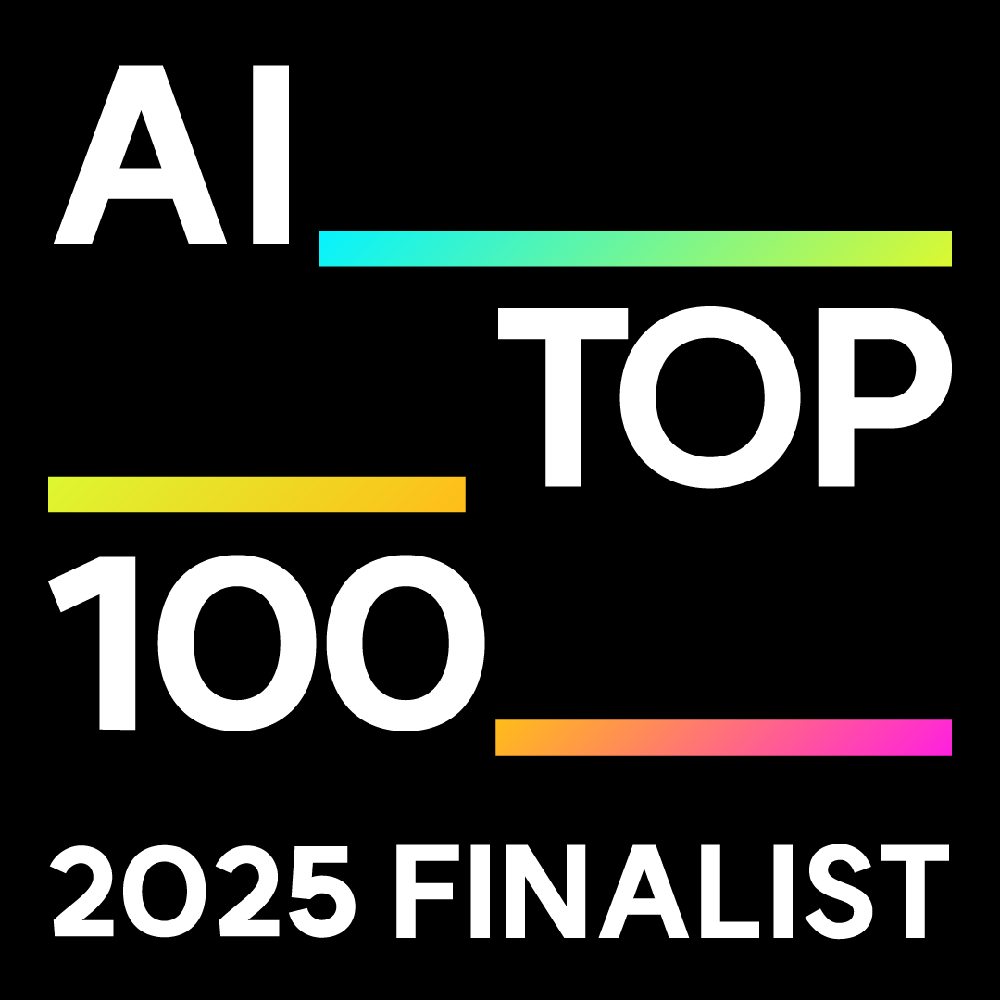
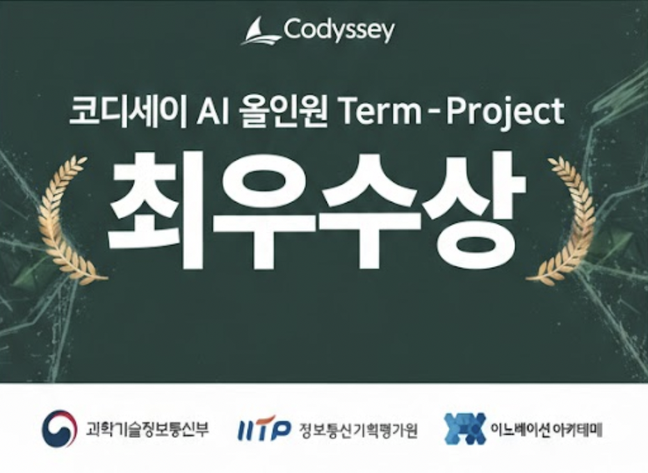
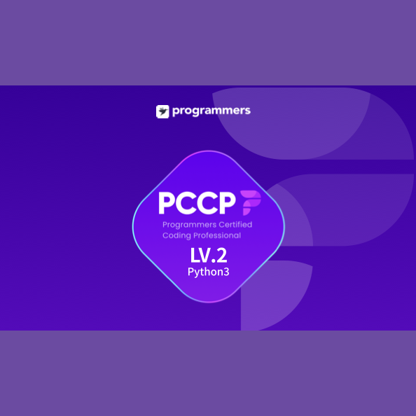

---

## 🚀 About

-50fa7b?style=for-the-badge)

---

## 💭 Quote

---

## 🎵 Hobbies

---

## 🏆 Achievements

| | Achievement | Issuer | Date |
|:---:|:---|:---|:---:|
|  | **AI_TOP_100 Finalist** | Kakao Impact × Brian Impact | 2026.01 |
|  | **IITP Director's Award** | IITP (Codyssey Best Project) | 2025.12 |
|  | **PCCP Python3 Lv.2** | Programmers | 2025.11 |
| | Korean Policy Society Conference | Presenter | 2025 |
| | Soongsil Univ. Programming Course | Completed | 2025 |

---

## 📂 Projects

  
  

  
  

---

## 🛠️ Skills

---

## 🏅 Trophy

---

## 📊 Stats

  
  

---

## 📈 Activity

---

## 🐍 Contribution Snake

---

## 📬 Contact

---

🇰🇷 한국어로 보기

 

### 🚀 소개

-50fa7b?style=for-the-badge)

### 💭 명언

### 🎵 취미

### 🏆 주요 성과

| | 성과 | 발행처 | 날짜 |
|:---:|:---|:---|:---:|
|  | **AI_TOP_100 Finalist** | 카카오임팩트 × 브라이언임팩트 | 2026.01 |
|  | **IITP 원장상** | 정보통신기획평가원 (코디세이 텀프로젝트 최우수상) | 2025.12 |
|  | **PCCP Python3 Lv.2** | 프로그래머스 | 2025.11 |
| | 한국정책학회 하계학술대회 | 발표 | 2025 |
| | 숭실대 프로그래밍 중급과정 | 수료 | 2025 |

### 📂 프로젝트

  
  

  
  

### 🛠️ 기술 스택

### 📊 통계

  
  

### 📬 연락처

